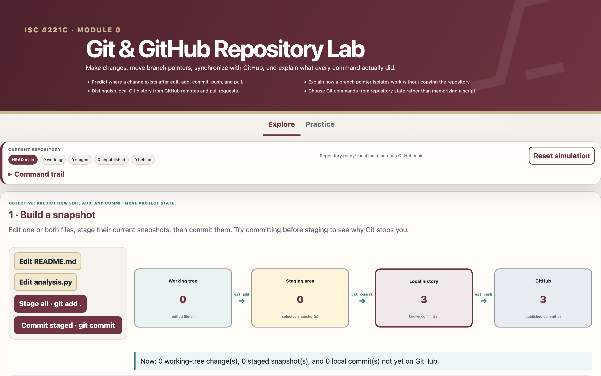
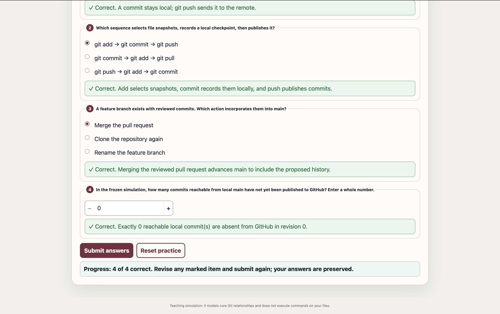

# My Reflections
### Your reflections on what you learned about Git and GitHub
Git is a program to track changes to files over time, and Github is where all those projects are hosted online. I practiced the basic workflow of adding, committing, and pushing. I also saw how pulling keeps the project on your computer synced with the one on the cloud.

### What concepts you're still confused about
More than confused, I'm still intimidated by **branching** and **merging**. The concept of having a whole separate copy where I can make all the edits I want without messing up the main version is incredible, and the fact two people can push their 'copies' and have to resolve the differences between them is scary.

### Which Module 0 lab you ran (Git and GitHub, or Python practice). And comments on your experience.
I did the Git and Github lab, which was a small interactive exercise to practice the Git workflow. The staging step did confuse me at first (why I had to ***add*** before I can ***commit***) but after messing around with it for a while, it clicked in my head.

### Screenshots

